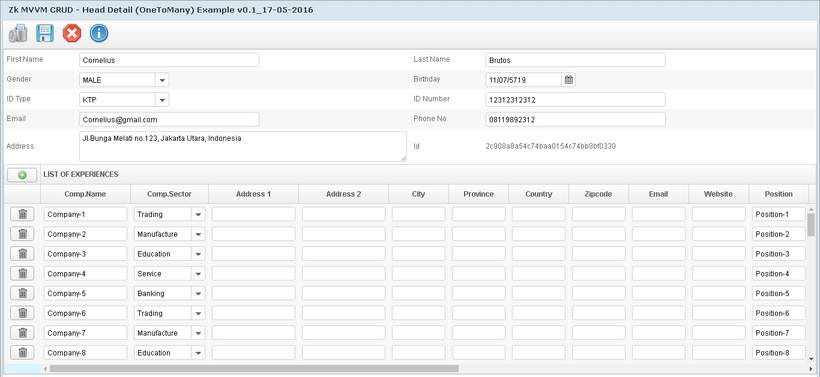

# zkmvvmcrud #
ZK MVVM CRUD Sample & Proof of Concept Project

## Version & Changes:##
19 May 2016 (initial version):

- Used Spring Data JPA as Repository.
- Used Spring Java Configuration (alternative to Spring XML Config).
- Used only ZK MVVM Style for form & CRUD logic.
- Used Hibernate Validator & ZK's build in BeanValidator scheme.
- Used entity association bidirectional OneToMany as example.

## Technology ##
- Java: JDK 7.u79
- Spring Framework: 4.2.6.RELEASE
- Hibernate Framework: 4.3.11
- Hibernate BeanValidator: 5.2.4
- ZK Framework: 7.0.3CE & 7.0.3PE-Eval
- Maven:3.3.x
- Database: PostgreSQL 9.4
- IDE: NetBeans 8.1

_For detail information about library & version view pom.xml_

## Installation ##
- Create database & schema with name 'testing' or you can run the 'init.sql' script within the resource folder.
- Both default username & password for postgreSQL is 'postgres' or you could make a change for Connection String in application properties file within the resource folder.
- For initial example data, you can run 'com.mkdika.zkmvvmcrud.cli.TestCLI' class directly. Change the variable PERSON\_NAME & TOTAL\_DETAIL as your needs.
- Servlet container server: Apache Tomcat 7.x, Jetty, etc to run application.

## Note ##
If available...
